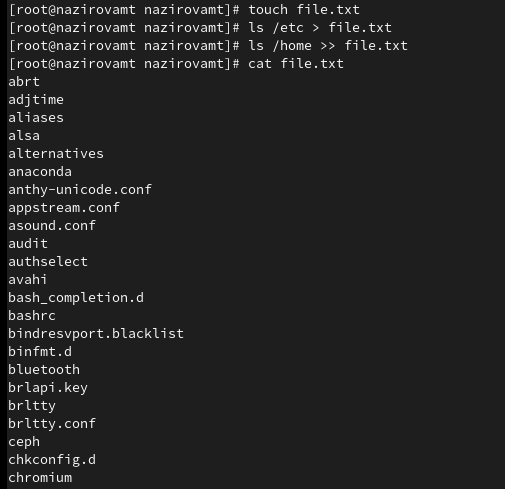

---
## Front matter
lang: ru-RU
title: "Лабораторная работа №5"
subtitle: 
author:
  - Назирова М.Т.
institute:
  - Российский университет дружбы народов, Москва, Россия
date: 16 марта 2023

## i18n babel
babel-lang: russian
babel-otherlangs: english

## Formatting pdf
toc: false
toc-title: Содержание
slide_level: 2
aspectratio: 169
section-titles: true
theme: metropolis
header-includes:
 - \metroset{progressbar=frametitle,sectionpage=progressbar,numbering=fraction}
 - '\makeatletter'
 - '\beamer@ignorenonframefalse'
 - '\makeatother'
---

# Информация

## Докладчик

:::::::::::::: {.columns align=center}
::: {.column width="70%"}

  * Назирова Малика Темржоновна
  * студентка группы НКабд-04-22
  * Факультет физико-математических и естественных наук
  * Российский университет дружбы народов
  * [1032225197@pfur.ru](mailto:1032225197@pfur.ru)
  * <https://github.com/sweetliiikk/study_2022-2023_os-intro.git>

:::
::: {.column width="30%"}

:::
::::::::::::::

## Цели и задачи

Ознакомление с инструментами поиска файлов и фильтрации текстовых данных.
Приобретение практических навыков: по управлению процессами (и заданиями), по
проверке использования диска и обслуживанию файловых систем.

# Выполнение лабораторной работы

## Вход в систему

{#fig:001 width=70%}

## Создаём файл и записываем туда названия файлов из каталога /etc и из домашнего каталога

{#fig:002 width=50%}

## Записываем в файл conf.txt имена всех файлов с расширением .conf из file.txt

{#fig:003 width=50%}

## Используя команду find определяем имена, начинавшиеся с символа с

{#fig:004 width=70%}

## Используя команду find выводим на экран файлы, начинающееся с символа h, из каталога /etc

{#fig:005 width=50%}

## Используя команду find запускаем процесс в фоновом режиме, которые будет записывать имена, начинающееся с log в файл ~/logfile

{#fig:006 width=70%}

## Удаляем файл

{#fig:007 width=70%}

## Запускаем gedit в фоновом режиме

{#fig:008 width=70%}

## Используем команду ps для определения идентификатора процесса

{#fig:009 width=70%}

## Открываем справку о каманде kill

{#fig:010 width=70%}

## Используем её для завершения процесса gedit

{#fig:011 width=70%}

## Получаем подробную информацию о команде df

{#fig:012 width=70%}

## Выполняем команду df

{#fig:013 width=70%}

## Получаем подробную информацию о команде du

{#fig:014 width=70%}

## Выполняем команду du

{#fig:015 width=70%}

## Открываем справку о команде find

{#fig:016 width=70%}

## Выводим имена всех директорий, которые есть в домашнем каталоге

{#fig:017 width=70%}

# Спасибо за внимание
