---
## Front matter
lang: ru-RU
title: "Лабораторная работа №7"
subtitle:
author:
  - Назирова М.Т.
institute:
  - Российский университет дружбы народов, Москва, Россия
date: 16 марта 2023

## i18n babel
babel-lang: russian
babel-otherlangs: english

## Formatting pdf
toc: false
toc-title: Содержание
slide_level: 2
aspectratio: 169
section-titles: true
theme: metropolis
header-includes:
 - \metroset{progressbar=frametitle,sectionpage=progressbar,numbering=fraction}
 - '\makeatletter'
 - '\beamer@ignorenonframefalse'
 - '\makeatother'
---

# Информация

## Докладчик

:::::::::::::: {.columns align=center}
::: {.column width="70%"}

  * Назирова Малика Темржоновна
  * студентка группы НКабд-04-22
  * Факультет физико-математических и естественных наук
  * Российский университет дружбы народов
  * [1032225197@pfur.ru](mailto:1032225197@pfur.ru)
  * <https://github.com/sweetliiikk/study_2022-2023_os-intro.git>

:::
::: {.column width="30%"}

:::
::::::::::::::

## Цели и задачи

- Создать шаблон презентации в Markdown
- Описать алгоритм создания выходных форматов презентаций

# Выполнение лабораторной работы

## Изучаем информация о mc

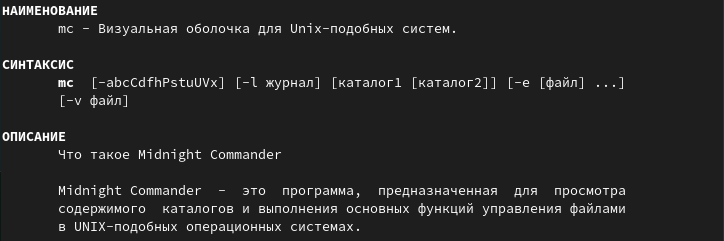{#fig:001 width=70%}

## Запуск mc

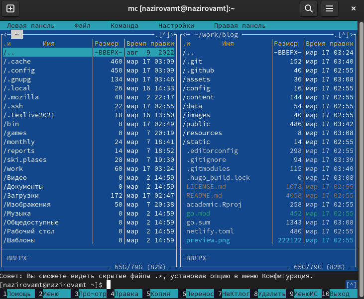{#fig:001 width=70%}

## Копируем файл

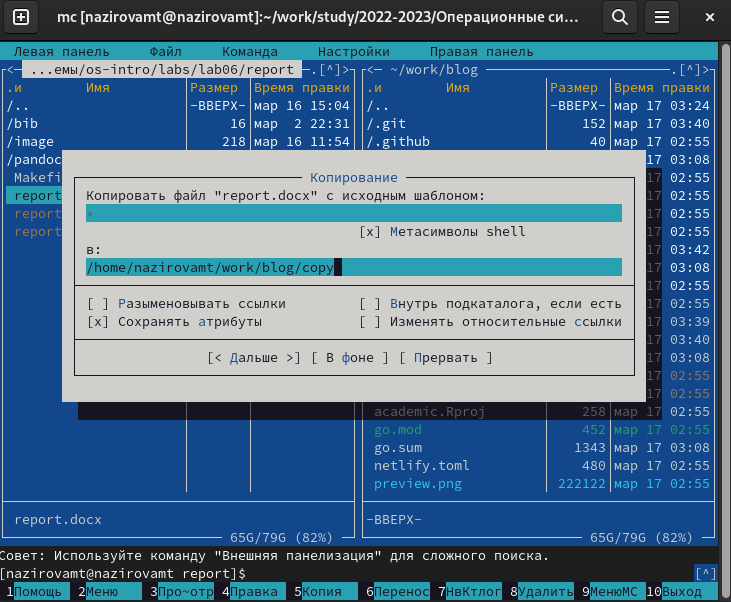{#fig:001 width=70%}

## Копируем файл

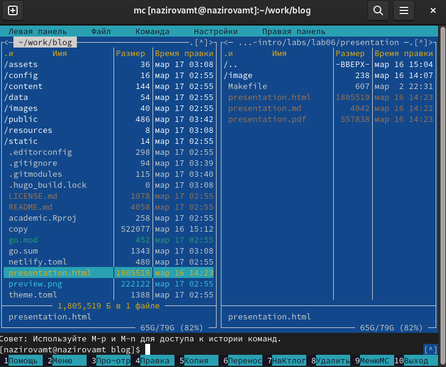{#fig:001 width=70%}

## Удаляем файл

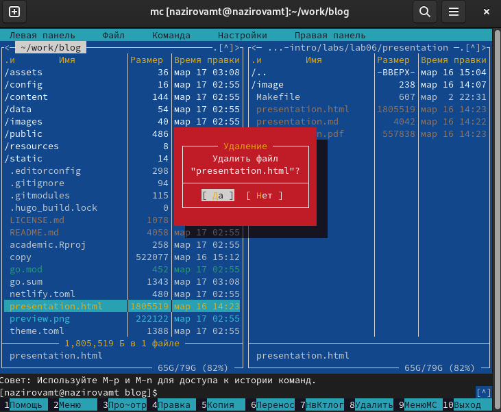{#fig:001 width=70%}

## Смотрим содержимое текстового файла

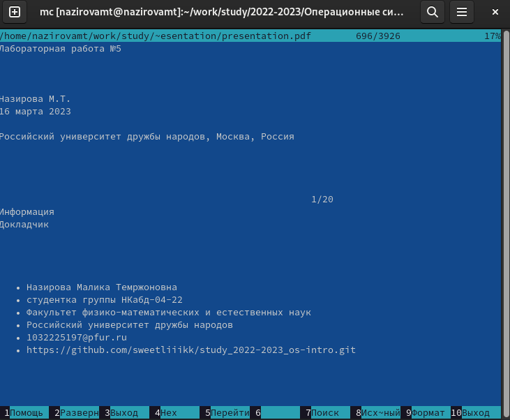{#fig:001 width=70%}

## Редактируем, не сохраняя изменения

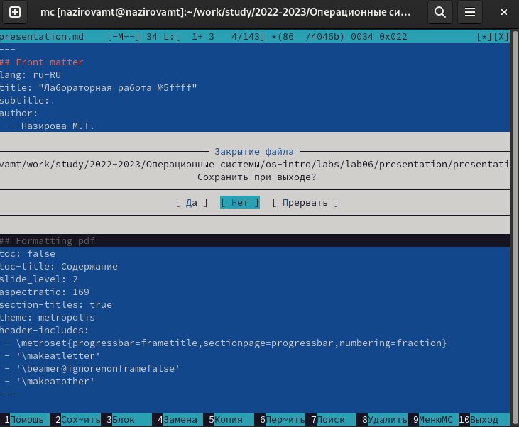{#fig:001 width=70%}

## Создаем каталог

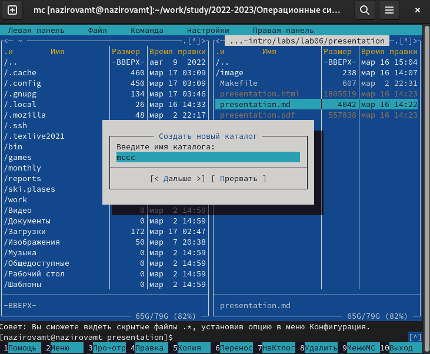{#fig:001 width=70%}

## Копируем файл в созданный каталог

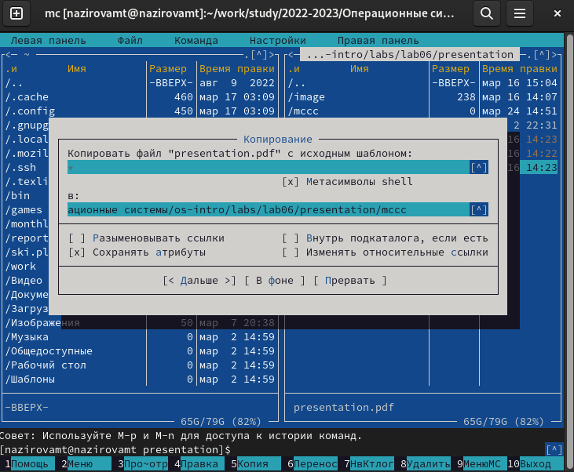{#fig:001 width=70%}

## Копируем файл в созданный каталог

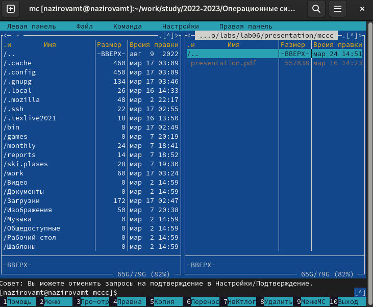{#fig:001 width=70%}

## Поиск файла с заданными условиями

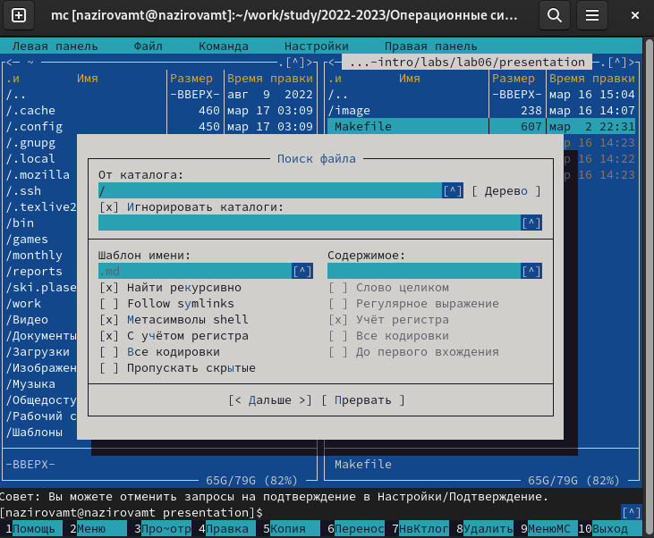{#fig:001 width=70%}

## Переходим в домашний каталог

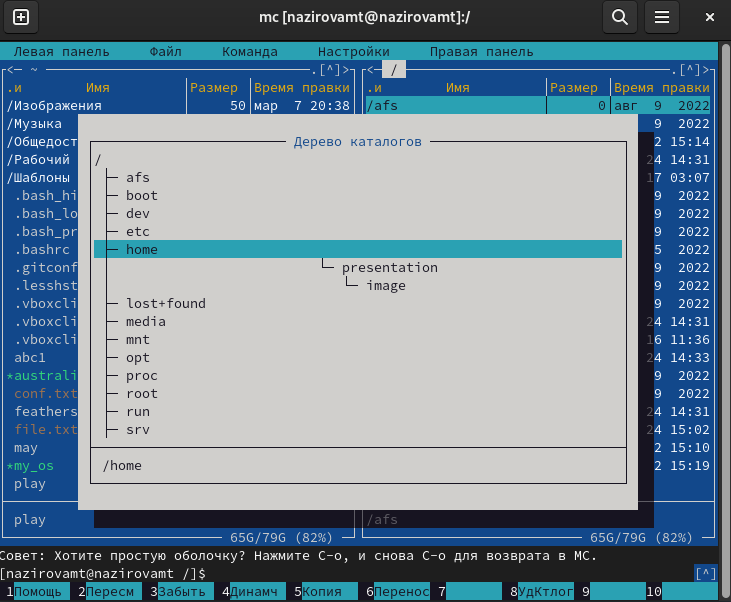{#fig:001 width=70%}

## Анализируем файл меню

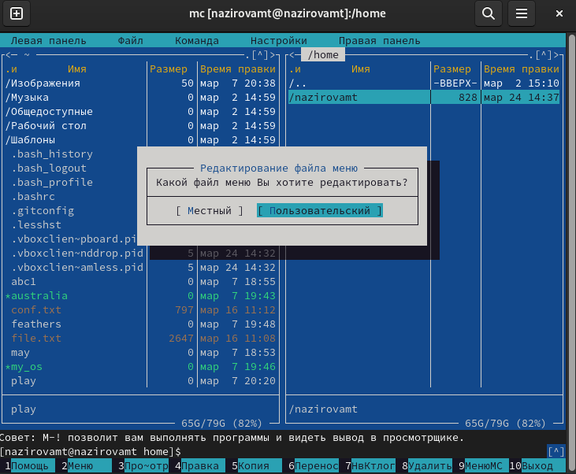{#fig:001 width=70%}

## Анализируем файл расширений

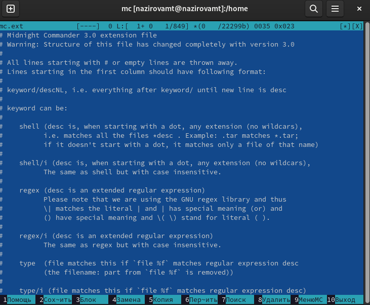{#fig:001 width=70%}

## Осваиваем операции по структуре экрана mc

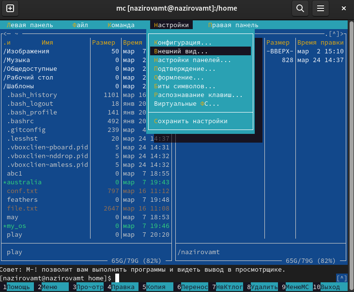{#fig:001 width=70%}

## Создаем текстовый файл

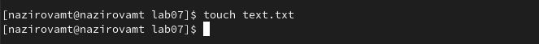{#fig:001 width=70%}

## Открываем файл в mc

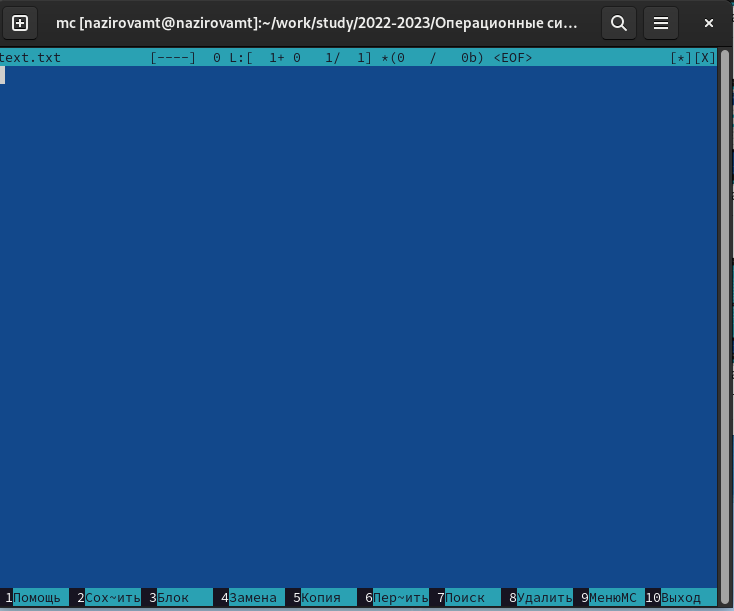{#fig:001 width=70%}

## Вставляем в файл текст, скопированный из другого файла

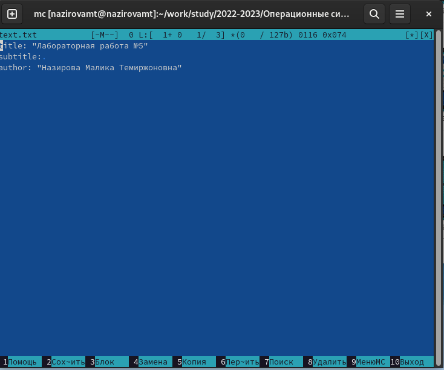{#fig:001 width=70%}

## Удаляем строку текста

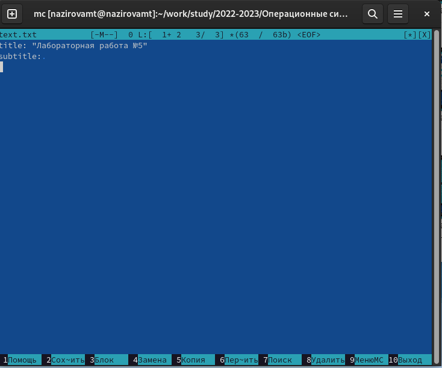{#fig:001 width=70%}

## Копируем текст на новую строку

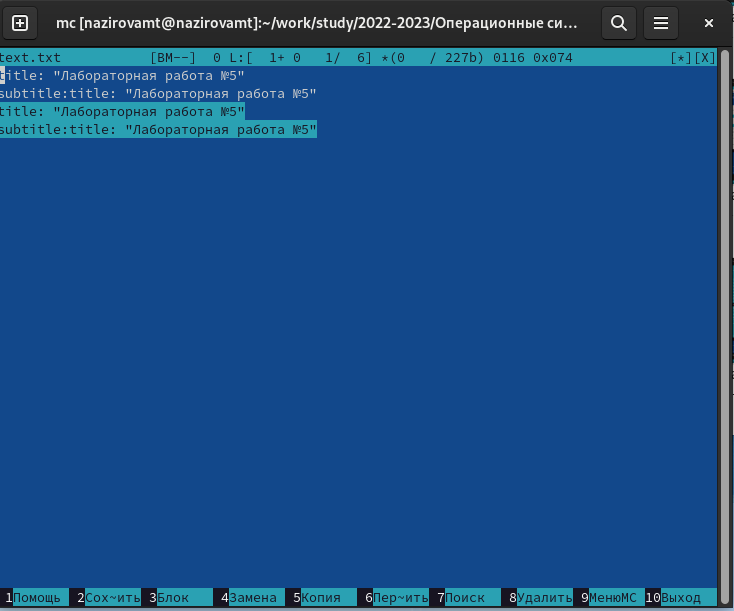{#fig:001 width=70%}

## Переносим текст на новую строку

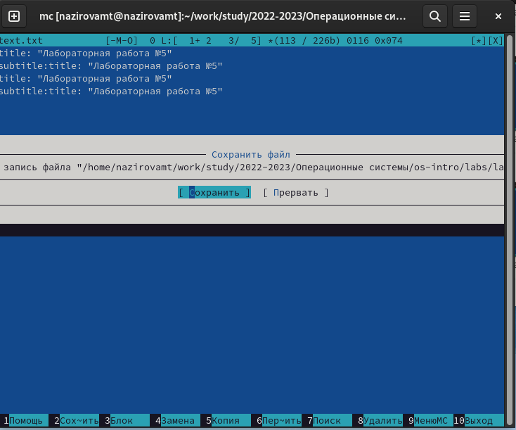{#fig:001 width=70%}

## Переходим в конец файла и пишем текст

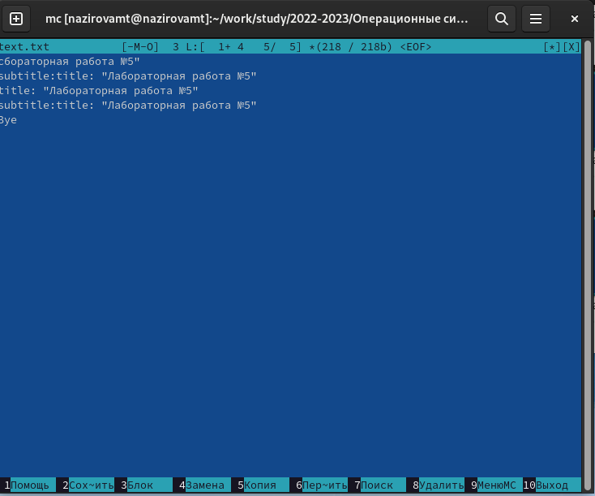{#fig:001 width=70%}

## Переходим в начало файла и пишем текст

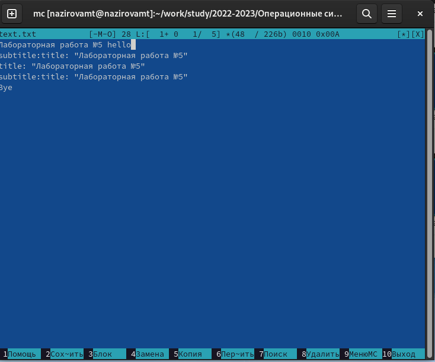{#fig:001 width=70%}

## Сохраняем файл и закрываем его

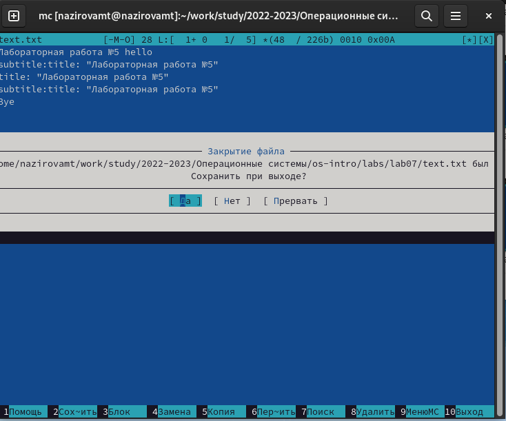{#fig:001 width=70%}

# Спасибо за внимание
