---
## Front matter
title: "Лабораторная работа №7"
subtitle:
author: "Назирова Малика Темиржоновна"

## Generic otions
lang: ru-RU
toc-title: "Содержание"

## Bibliography
bibliography: bib/cite.bib
csl: pandoc/csl/gost-r-7-0-5-2008-numeric.csl

## Pdf output format
toc: true # Table of contents
toc-depth: 2
lof: true # List of figures
lot: true # List of tables
fontsize: 12pt
linestretch: 1.5
papersize: a4
documentclass: scrreprt
## I18n polyglossia
polyglossia-lang:
  name: russian
  options:
	- spelling=modern
	- babelshorthands=true
polyglossia-otherlangs:
  name: english
## I18n babel
babel-lang: russian
babel-otherlangs: english
## Fonts
mainfont: PT Serif
romanfont: PT Serif
sansfont: PT Sans
monofont: PT Mono
mainfontoptions: Ligatures=TeX
romanfontoptions: Ligatures=TeX
sansfontoptions: Ligatures=TeX,Scale=MatchLowercase
monofontoptions: Scale=MatchLowercase,Scale=0.9
## Biblatex
biblatex: true
biblio-style: "gost-numeric"
biblatexoptions:
  - parentracker=true
  - backend=biber
  - hyperref=auto
  - language=auto
  - autolang=other*
  - citestyle=gost-numeric
## Pandoc-crossref LaTeX customization
figureTitle: "Рис."
tableTitle: "Таблица"
listingTitle: "Листинг"
lolTitle: "Листинги"
## Misc options
indent: true
header-includes:
  - \usepackage{indentfirst}
  - \usepackage{float} # keep figures where there are in the text
  - \floatplacement{figure}{H} # keep figures where there are in the text
---

# Цель работы

Освоение основных возможностей командной оболочки Midnight Commander. Приобретение навыков практической работы по просмотру каталогов и файлов; манипуляций с ними.

# Задание

1. Изучите информацию о mc, вызвав в командной строке man mc.
2. Запустите из командной строки mc, изучите его структуру и меню.
3. Выполните несколько операций в mc, используя управляющие клавиши (операции
с панелями; выделение/отмена выделения файлов, копирование/перемещение файлов, получение информации о размере и правах доступа на файлы и/или каталоги
и т.п.)
4. Выполните основные команды меню левой (или правой) панели. Оцените степень
подробности вывода информации о файлах.
5. Используя возможности подменю Файл , выполните:
– просмотр содержимого текстового файла;
– редактирование содержимого текстового файла (без сохранения результатов
редактирования);
– создание каталога;
– копирование в файлов в созданный каталог.
6. С помощью соответствующих средств подменю Команда осуществите:
– поиск в файловой системе файла с заданными условиями (например, файла
с расширением .c или .cpp, содержащего строку main);
– выбор и повторение одной из предыдущих команд;
– переход в домашний каталог;
– анализ файла меню и файла расширений.
7. Вызовите подменю Настройки . Освойте операции, определяющие структуру экрана mc
(Full screen, Double Width, Show Hidden Files и т.д.).
8. Создайте текстовой файл text.txt.
9. Откройте этот файл с помощью встроенного в mc редактора.
10. Вставьте в открытый файл небольшой фрагмент текста, скопированный из любого
другого файла или Интернета.
11. Проделайте с текстом следующие манипуляции, используя горячие клавиши:
11.1. Удалите строку текста.
11.2. Выделите фрагмент текста и скопируйте его на новую строку.
11.3. Выделите фрагмент текста и перенесите его на новую строку.
11.4. Сохраните файл.
11.5. Отмените последнее действие.
11.6. Перейдите в конец файла (нажав комбинацию клавиш) и напишите некоторый
текст.
11.7. Перейдите в начало файла (нажав комбинацию клавиш) и напишите некоторый
текст.
11.8. Сохраните и закройте файл.
12. Откройте файл с исходным текстом на некотором языке программирования (например C или Java)
13. Используя меню редактора, включите подсветку синтаксиса, если она не включена,
или выключите, если она включена.

# Выполнение лабораторной работы

1. Изучите информацию о mc, вызвав в командной строке man mc.

{#fig:001 width=70%}

2. Запустите из командной строки mc, изучите его структуру и меню.

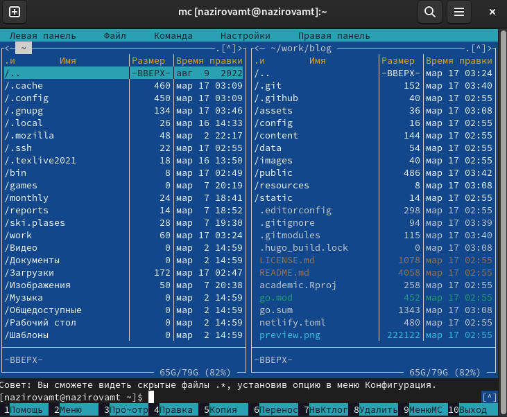{#fig:001 width=70%}

3. Выполните несколько операций в mc, используя управляющие клавиши (операции
с панелями; выделение/отмена выделения файлов, копирование/перемещение файлов, получение информации о размере и правах доступа на файлы и/или каталоги
и т.п.)

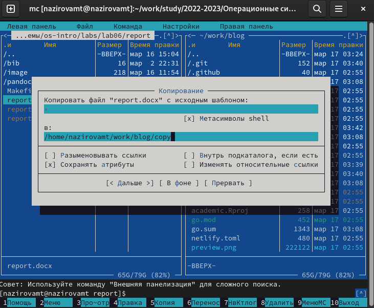{#fig:001 width=70%}

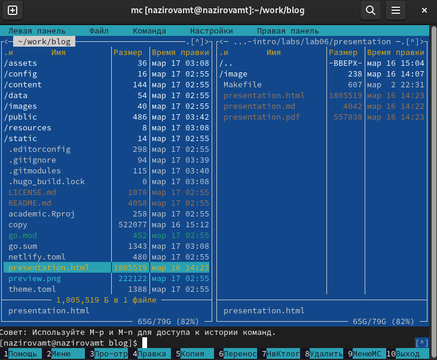{#fig:001 width=70%}

4. Выполните основные команды меню левой (или правой) панели. Оцените степень
подробности вывода информации о файлах.

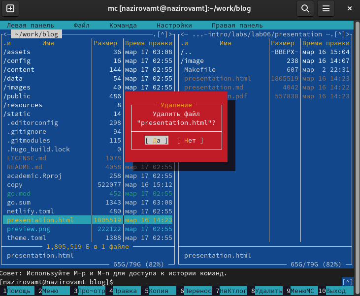{#fig:001 width=70%}

5. Используя возможности подменю Файл , выполните:
– просмотр содержимого текстового файла;
– редактирование содержимого текстового файла (без сохранения результатов
редактирования);
– создание каталога;
– копирование файлов в созданный каталог.

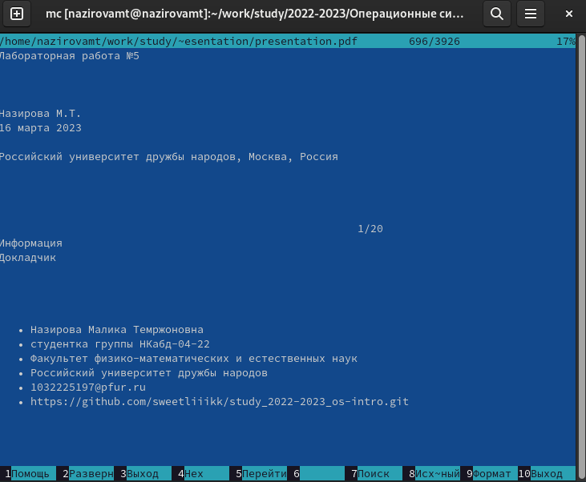{#fig:001 width=70%}

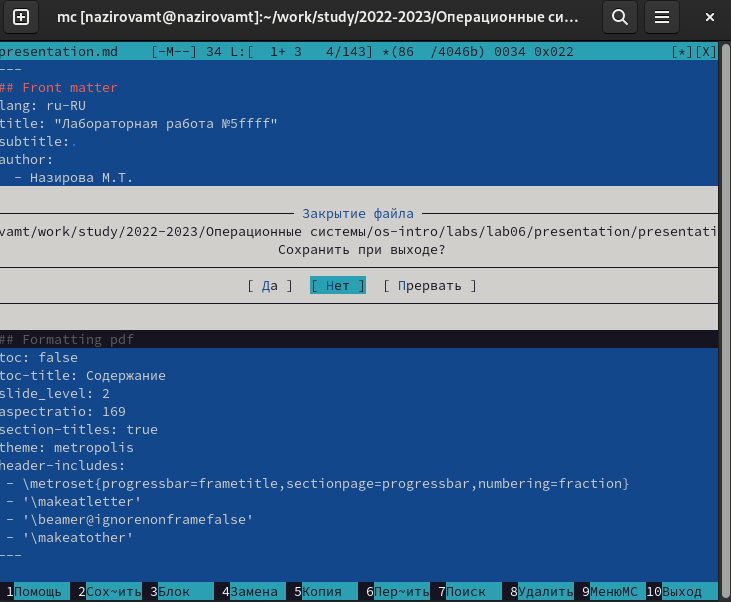{#fig:001 width=70%}

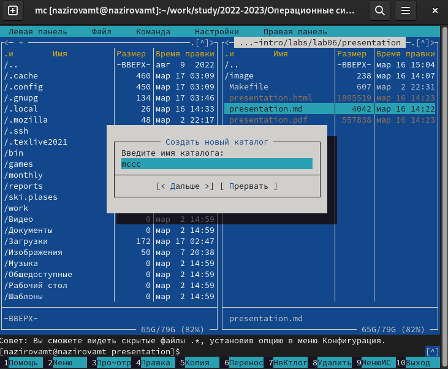{#fig:001 width=70%}

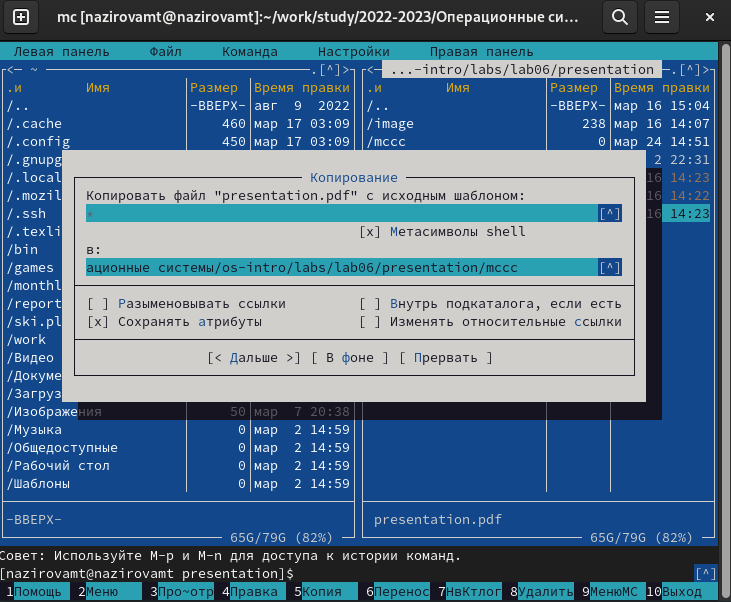{#fig:001 width=70%}

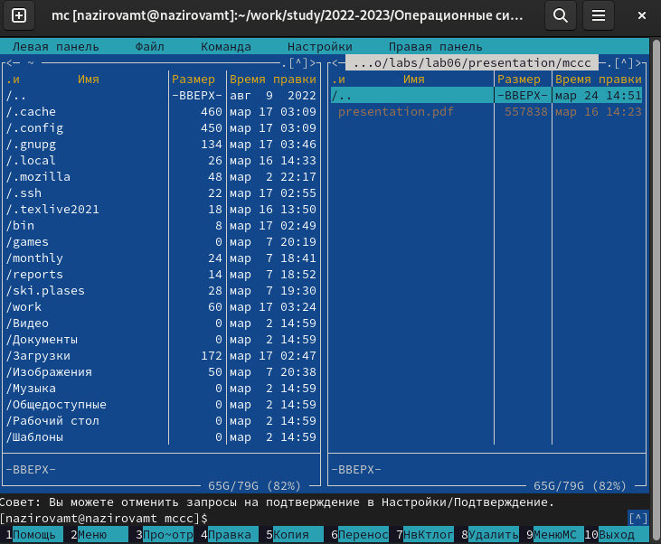{#fig:001 width=70%}

6. С помощью соответствующих средств подменю Команда осуществите:
– поиск в файловой системе файла с заданными условиями (например, файла
с расширением .c или .cpp, содержащего строку main);
– выбор и повторение одной из предыдущих команд;
– переход в домашний каталог;
– анализ файла меню и файла расширений.

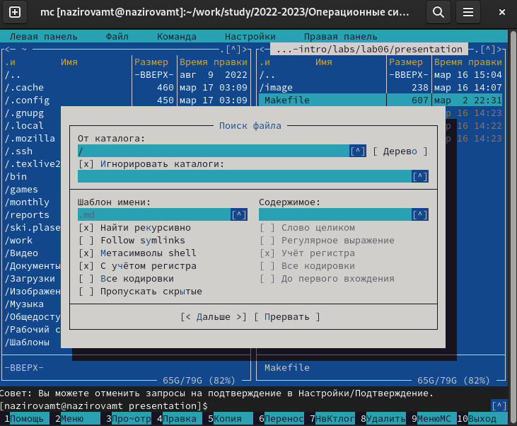{#fig:001 width=70%}

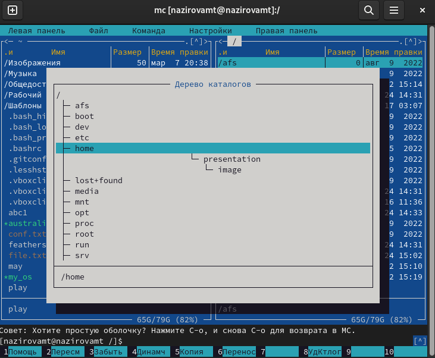{#fig:001 width=70%}

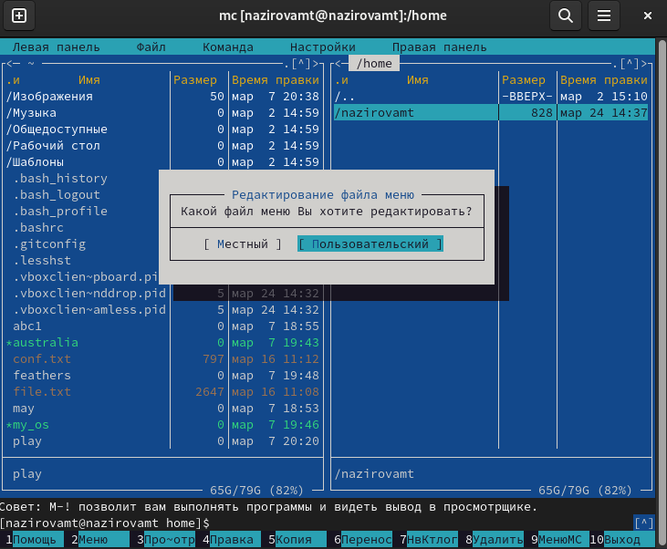{#fig:001 width=70%}

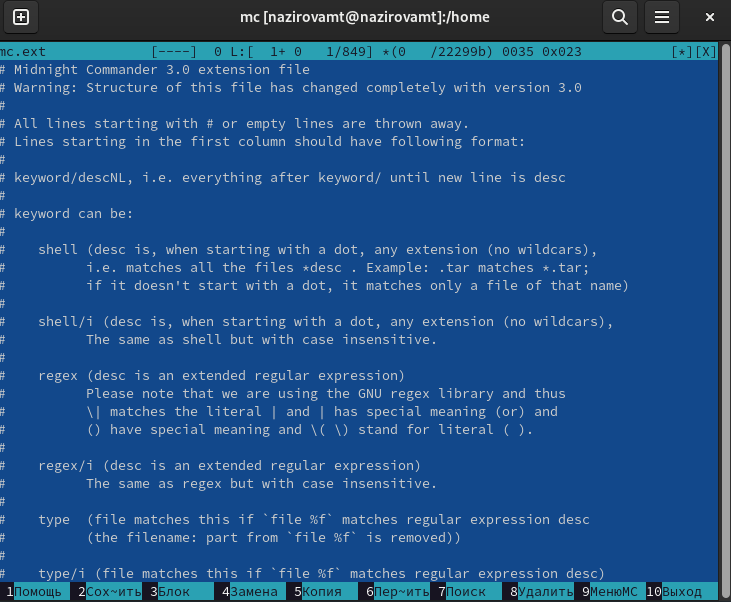{#fig:001 width=70%}

7. Вызовите подменю Настройки . Освойте операции, определяющие структуру экрана mc
(Full screen, Double Width, Show Hidden Files и т.д.).

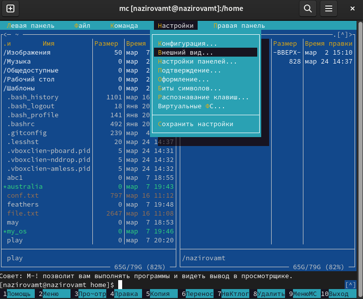{#fig:001 width=70%}

8. Создайте текстовой файл text.txt.

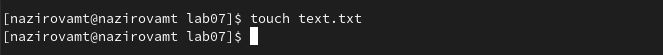{#fig:001 width=70%}

9. Откройте этот файл с помощью встроенного в mc редактора.

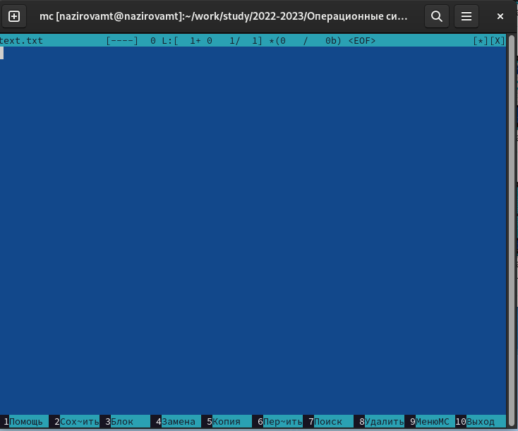{#fig:001 width=70%}

10. Вставьте в открытый файл небольшой фрагмент текста, скопированный из любого
другого файла или Интернета.

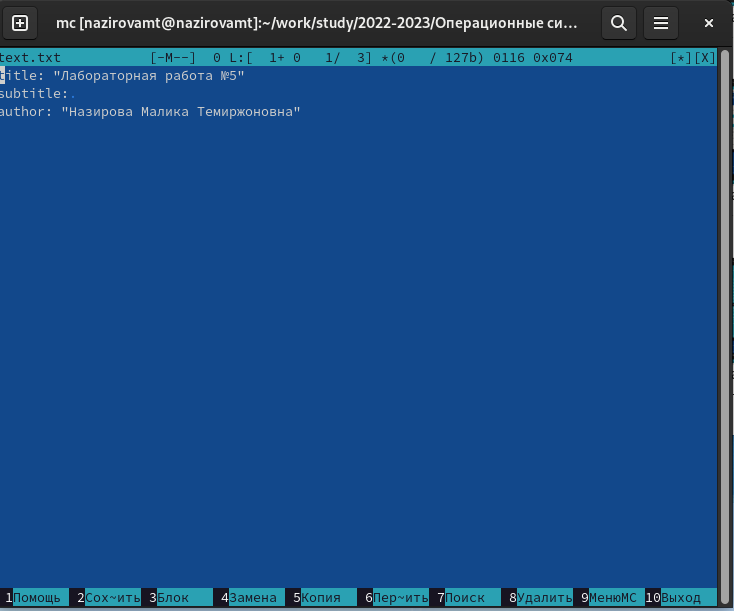{#fig:001 width=70%}

11. Проделайте с текстом следующие манипуляции, используя горячие клавиши:
11.1. Удалите строку текста.
11.2. Выделите фрагмент текста и скопируйте его на новую строку.
11.3. Выделите фрагмент текста и перенесите его на новую строку.
11.4. Сохраните файл.
11.5. Отмените последнее действие.
11.6. Перейдите в конец файла (нажав комбинацию клавиш) и напишите некоторый
текст.
11.7. Перейдите в начало файла (нажав комбинацию клавиш) и напишите некоторый
текст.
11.8. Сохраните и закройте файл.

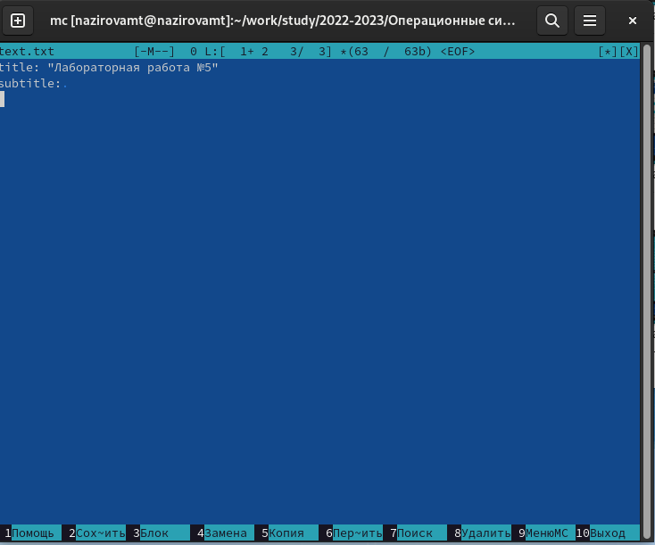{#fig:001 width=70%}

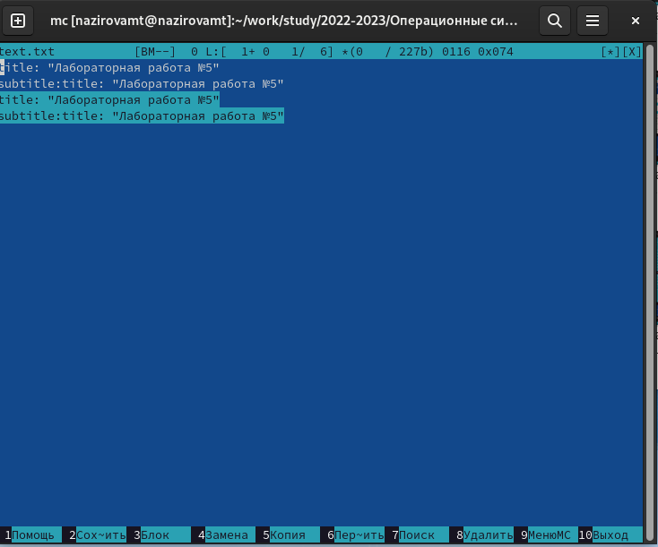{#fig:001 width=70%}

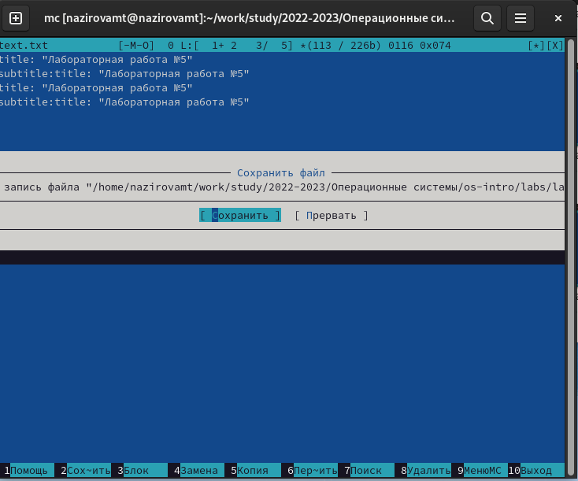{#fig:001 width=70%}

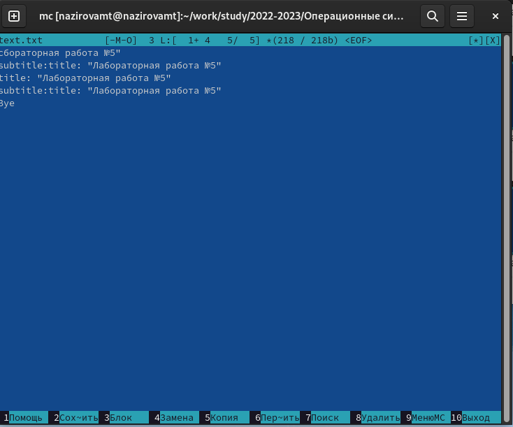{#fig:001 width=70%}

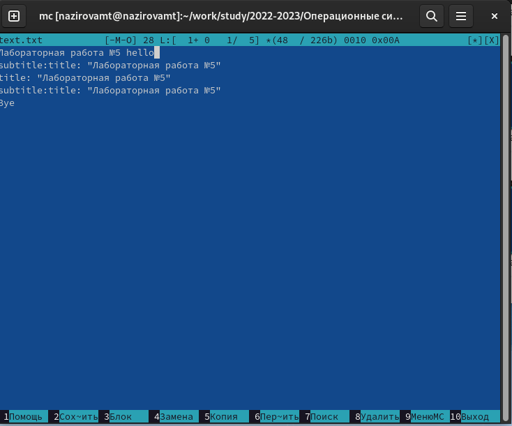{#fig:001 width=70%}

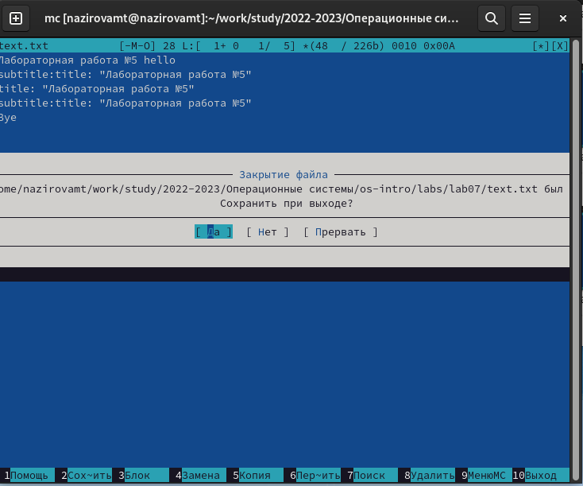{#fig:001 width=70%}

# Выводы

Освоили основные возможности командной оболочки Midnight Commander. Приобрели навыки практической работы по просмотру каталогов и файлов; манипуляций с ними.
