---
## Front matter
lang: ru-RU
title: "Лабораторная работа №9"
subtitle: 
author:
  - Назирова М.Т.
institute:
  - Российский университет дружбы народов, Москва, Россия
date: 8 апреля 2023

## i18n babel
babel-lang: russian
babel-otherlangs: english

## Formatting pdf
toc: false
toc-title: Содержание
slide_level: 2
aspectratio: 169
section-titles: true
theme: metropolis
header-includes:
 - \metroset{progressbar=frametitle,sectionpage=progressbar,numbering=fraction}
 - '\makeatletter'
 - '\beamer@ignorenonframefalse'
 - '\makeatother'
---

# Информация

## Докладчик

:::::::::::::: {.columns align=center}
::: {.column width="70%"}

  * Назирова Малика Темржоновна
  * студентка группы НКабд-04-22
  * Факультет физико-математических и естественных наук
  * Российский университет дружбы народов
  * [1032225197@pfur.ru](mailto:1032225197@pfur.ru)
  * <https://github.com/sweetliiikk/study_2022-2023_os-intro.git>

:::
::: {.column width="30%"}

:::
::::::::::::::

## Цели и задачи

Познакомиться с операционной системой Linux. Получить практические навыки работы с редактором Emacs.

# Выполнение лабораторной работы

## Открываем emacs

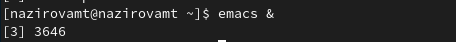{#fig:001 width=70%}

## Создать файл lab07.sh с помощью комбинации Ctrl-x Ctrl-f (C-x C-f).

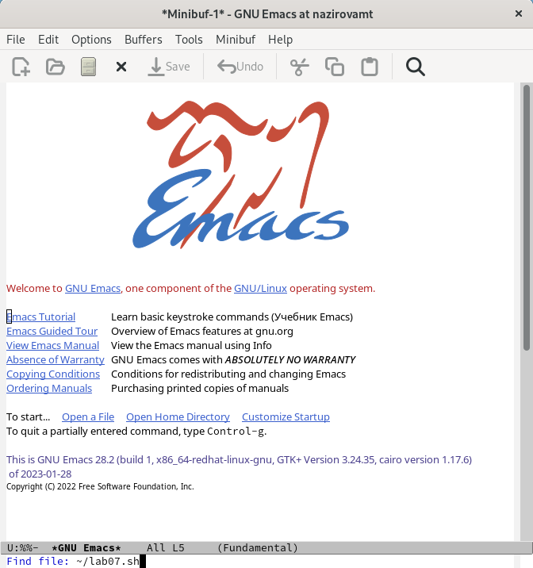{#fig:001 width=70%}

## Наберите текст.

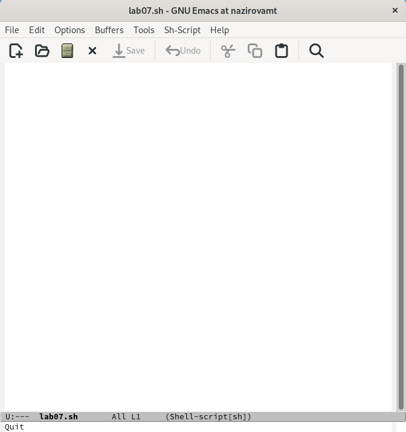{#fig:001 width=70%}

## Сохранение файла с помощью комбинации Ctrl-x Ctrl-s (C-x C-s).

{#fig:001 width=70%}

## Вырезать одной командой целую строку (С-k).

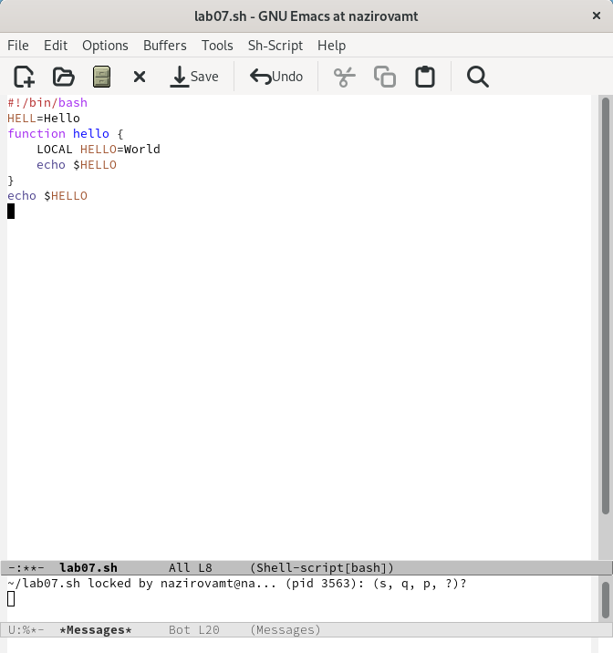{#fig:001 width=70%}

## Вставить эту строку в конец файла (C-y).

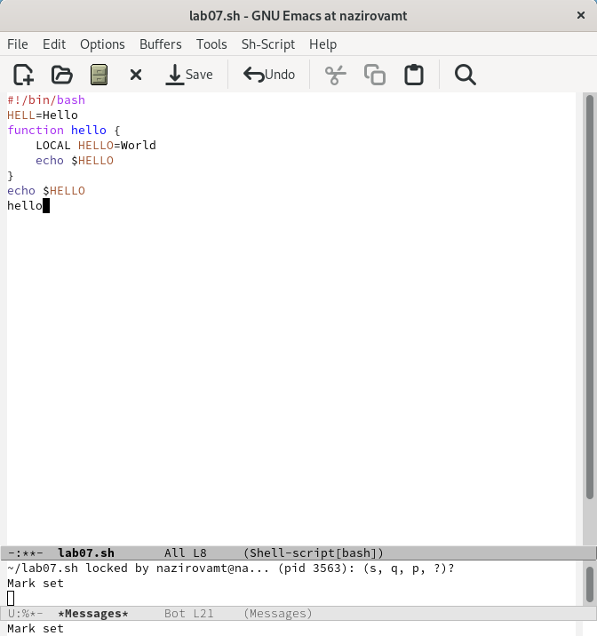{#fig:001 width=70%}

## Выделить область текста, скопировать его в буфер обмена и вставить область в конец файла.

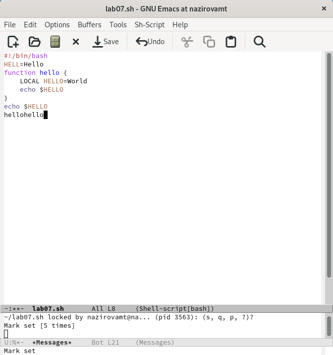{#fig:001 width=70%}

## Вновь выделить эту область и на этот раз вырезать её (C-w).

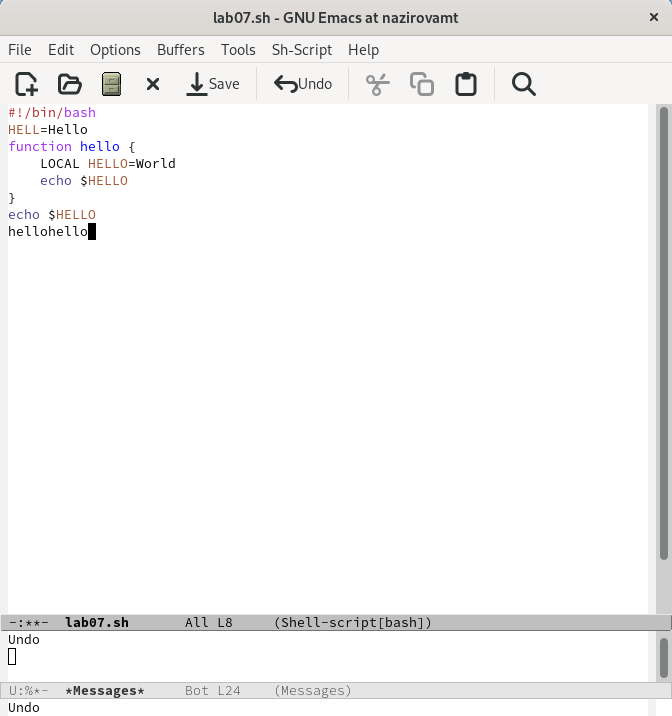{#fig:001 width=70%}

## Отмените последнее действие (C-/).

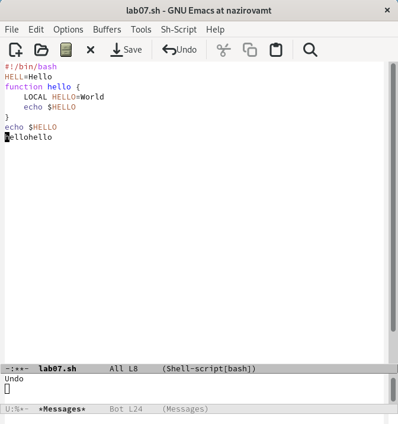{#fig:001 width=70%}

## Переместите курсор в начало строки (C-a).

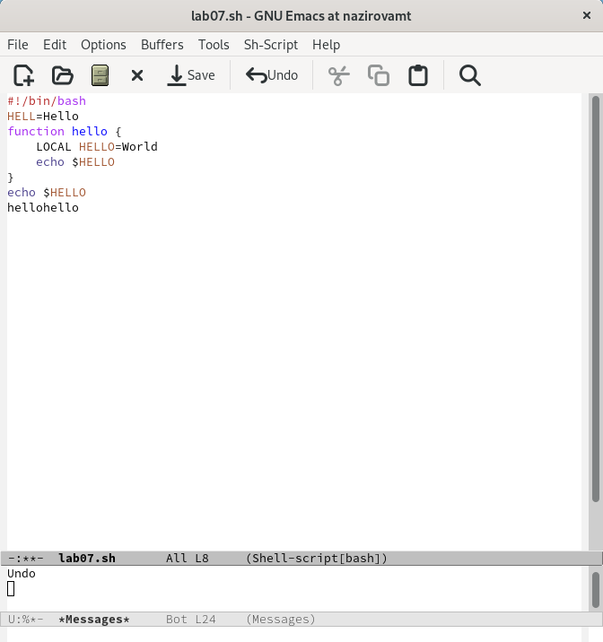{#fig:001 width=70%}

## Переместите курсор в конец строки (C-e).

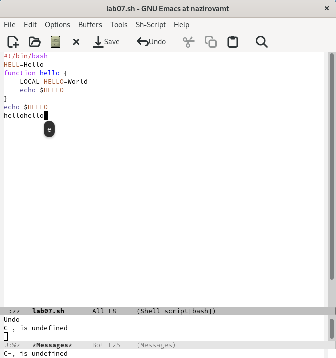{#fig:001 width=70%}

## Переместите курсор в конец буфера (M->).

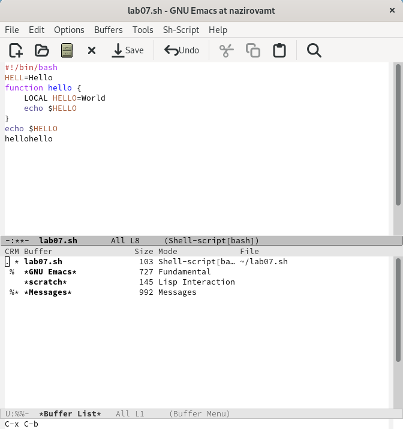{#fig:001 width=70%}

## Вывести список активных буферов на экран (C-x C-b).

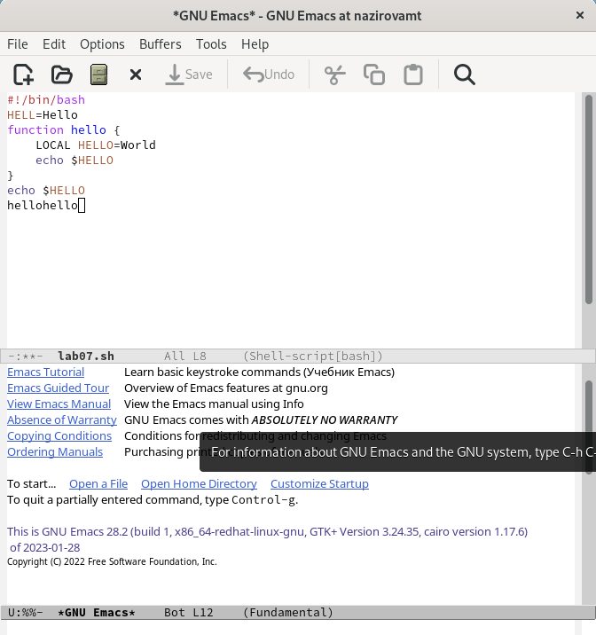{#fig:001 width=70%}

## Переместитесь во вновь открытое окно (C-x) o со списком открытых буферов
и переключитесь на другой буфер.

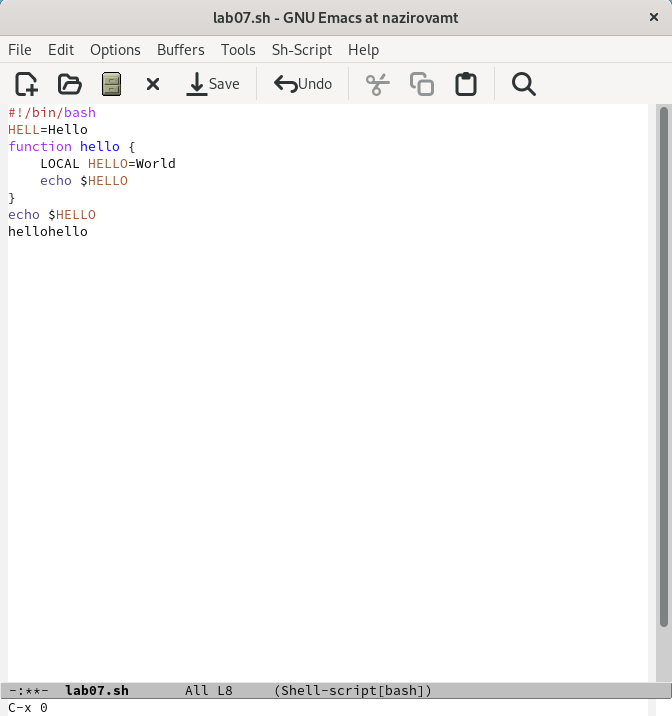{#fig:001 width=70%}

## Закройте это окно (C-x 0).

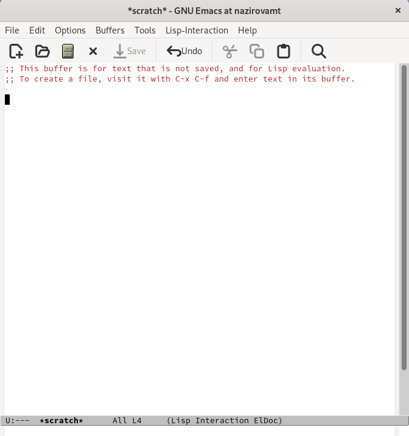{#fig:001 width=70%}

## Теперь вновь переключайтесь между буферами, но уже без вывода их списка на
экран (C-x b).

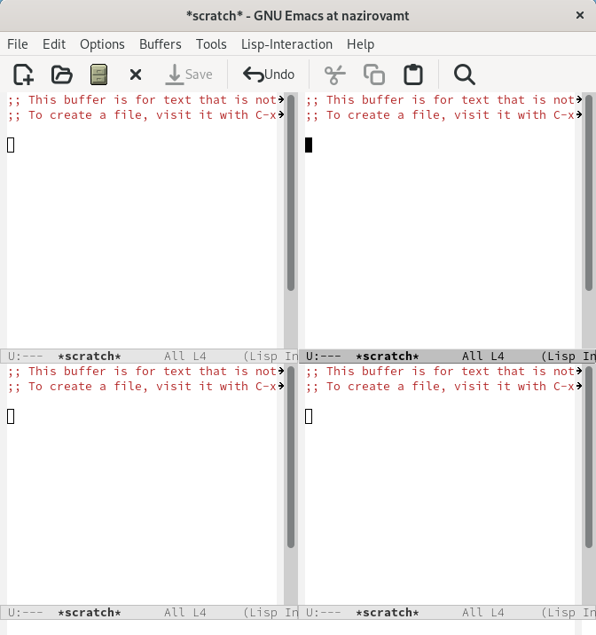{#fig:001 width=70%}

## Поделите фрейм на 4 части: разделите фрейм на два окна по вертикали (C-x 3),
а затем каждое из этих окон на две части по горизонтали (C-x 2).

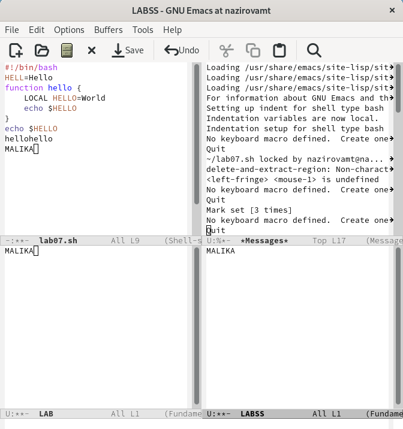{#fig:001 width=70%}

## В каждом из четырёх созданных окон откройте новый буфер (файл) и введите
несколько строк текста.

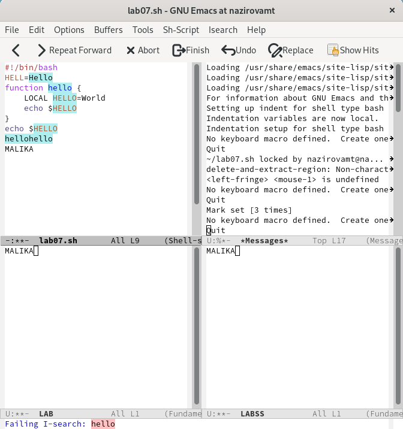{#fig:001 width=70%}

## Переключитесь в режим поиска (C-s) и найдите несколько слов, присутствующих
в тексте.

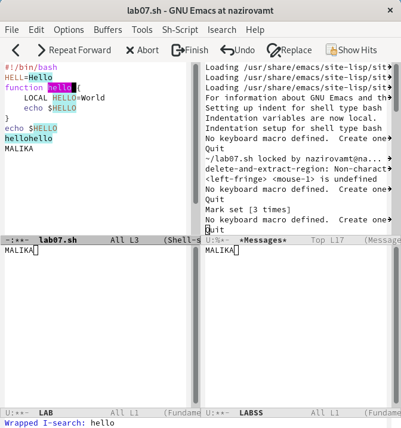{#fig:001 width=70%}

## Переключайтесь между результатами поиска, нажимая C-s.

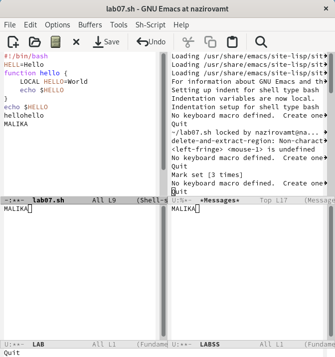{#fig:001 width=70%}

# Спасибо за внимание!)
