---
## Front matter
title: "Лабораторная работа №9"
subtitle: 
author: "Назирова Малика Темиржоновна"

## Generic otions
lang: ru-RU
toc-title: "Содержание"

## Bibliography
bibliography: bib/cite.bib
csl: pandoc/csl/gost-r-7-0-5-2008-numeric.csl

## Pdf output format
toc: true # Table of contents
toc-depth: 2
lof: true # List of figures
lot: true # List of tables
fontsize: 12pt
linestretch: 1.5
papersize: a4
documentclass: scrreprt
## I18n polyglossia
polyglossia-lang:
  name: russian
  options:
	- spelling=modern
	- babelshorthands=true
polyglossia-otherlangs:
  name: english
## I18n babel
babel-lang: russian
babel-otherlangs: english
## Fonts
mainfont: PT Serif
romanfont: PT Serif
sansfont: PT Sans
monofont: PT Mono
mainfontoptions: Ligatures=TeX
romanfontoptions: Ligatures=TeX
sansfontoptions: Ligatures=TeX,Scale=MatchLowercase
monofontoptions: Scale=MatchLowercase,Scale=0.9
## Biblatex
biblatex: true
biblio-style: "gost-numeric"
biblatexoptions:
  - parentracker=true
  - backend=biber
  - hyperref=auto
  - language=auto
  - autolang=other*
  - citestyle=gost-numeric
## Pandoc-crossref LaTeX customization
figureTitle: "Рис."
tableTitle: "Таблица"
listingTitle: "Листинг"
lofTitle: "Список иллюстраций"
lotTitle: "Список таблиц"
lolTitle: "Листинги"
## Misc options
indent: true
header-includes:
  - \usepackage{indentfirst}
  - \usepackage{float} # keep figures where there are in the text
  - \floatplacement{figure}{H} # keep figures where there are in the text
---

# Цель работы

Познакомиться с операционной системой Linux. Получить практические навыки работы с редактором Emacs.

# Задание

1. Открыть emacs.
2. Создать файл lab07.sh с помощью комбинации Ctrl-x Ctrl-f (C-x C-f).
3. Наберите текст:
#!/bin/bash
HELL=Hello
function hello {
LOCAL HELLO=World
echo $HELLO
}
echo $HELLO
hello
4. Сохранить файл с помощью комбинации Ctrl-x Ctrl-s (C-x C-s).
5. Проделать с текстом стандартные процедуры редактирования, каждое действие должно осуществляться комбинацией клавиш.
5.1. Вырезать одной командой целую строку (С-k).
5.2. Вставить эту строку в конец файла (C-y).
5.3. Выделить область текста (C-space).
5.4. Скопировать область в буфер обмена (M-w).
5.5. Вставить область в конец файла.
5.6. Вновь выделить эту область и на этот раз вырезать её (C-w).
5.7. Отмените последнее действие (C-/).
6. Научитесь использовать команды по перемещению курсора.
6.1. Переместите курсор в начало строки (C-a).
6.2. Переместите курсор в конец строки (C-e).
6.3. Переместите курсор в начало буфера (M-<).
6.4. Переместите курсор в конец буфера (M->).
7. Управление буферами.
7.1. Вывести список активных буферов на экран (C-x C-b).
7.2. Переместитесь во вновь открытое окно (C-x) o со списком открытых буферов
и переключитесь на другой буфер.
7.3. Закройте это окно (C-x 0).
7.4. Теперь вновь переключайтесь между буферами, но уже без вывода их списка на
экран (C-x b).
8. Управление окнами.
8.1. Поделите фрейм на 4 части: разделите фрейм на два окна по вертикали (C-x 3),
а затем каждое из этих окон на две части по горизонтали (C-x 2)
8.2. В каждом из четырёх созданных окон откройте новый буфер (файл) и введите
несколько строк текста.
9. Режим поиска
9.1. Переключитесь в режим поиска (C-s) и найдите несколько слов, присутствующих
в тексте.
9.2. Переключайтесь между результатами поиска, нажимая C-s.
9.3. Выйдите из режима поиска, нажав C-g.
9.4. Перейдите в режим поиска и замены (M-%), введите текст, который следует найти
и заменить, нажмите Enter , затем введите текст для замены. После того как будут
подсвечены результаты поиска, нажмите ! для подтверждения замены.
9.5. Испробуйте другой режим поиска, нажав M-s o. Объясните, чем он отличается от
обычного режима?

# Выполнение лабораторной работы

1. Открыть emacs

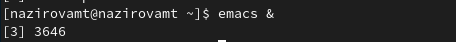{#fig:001 width=70%}

2. Создать файл lab07.sh с помощью комбинации Ctrl-x Ctrl-f (C-x C-f).

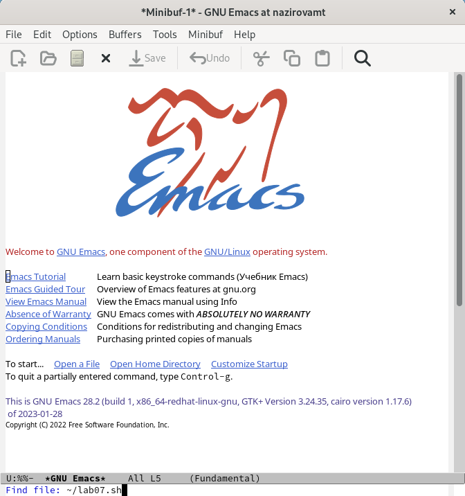{#fig:001 width=70%}

3. Наберите текст.

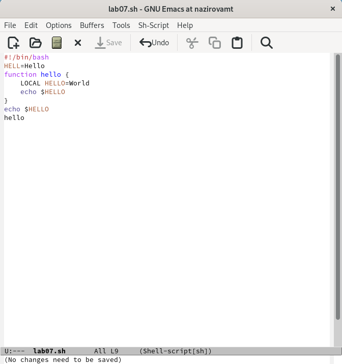{#fig:001 width=70%}

4. Сохранение файла с помощью комбинации Ctrl-x Ctrl-s (C-x C-s).

{#fig:001 width=70%}

5. Вырезать одной командой целую строку (С-k).

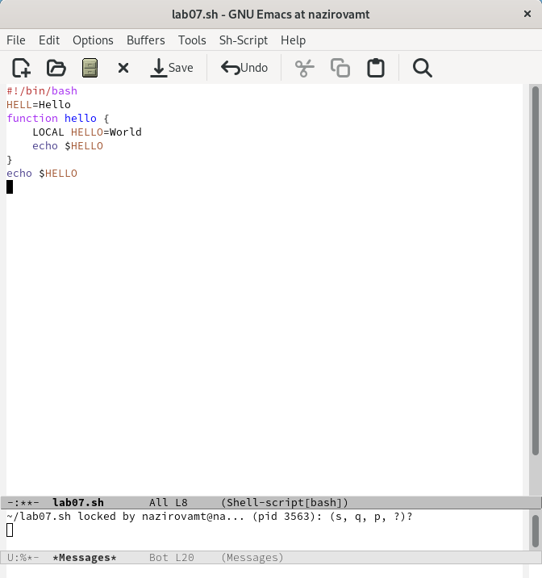{#fig:001 width=70%}

6. Вставить эту строку в конец файла (C-y).

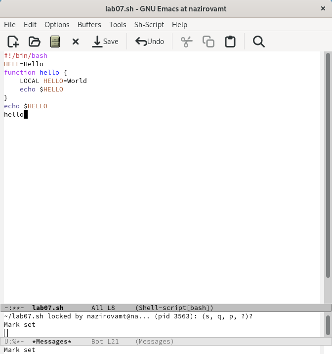{#fig:001 width=70%}

7. Выделить область текста, скопировать его в буфер обмена и вставить область в конец файла.

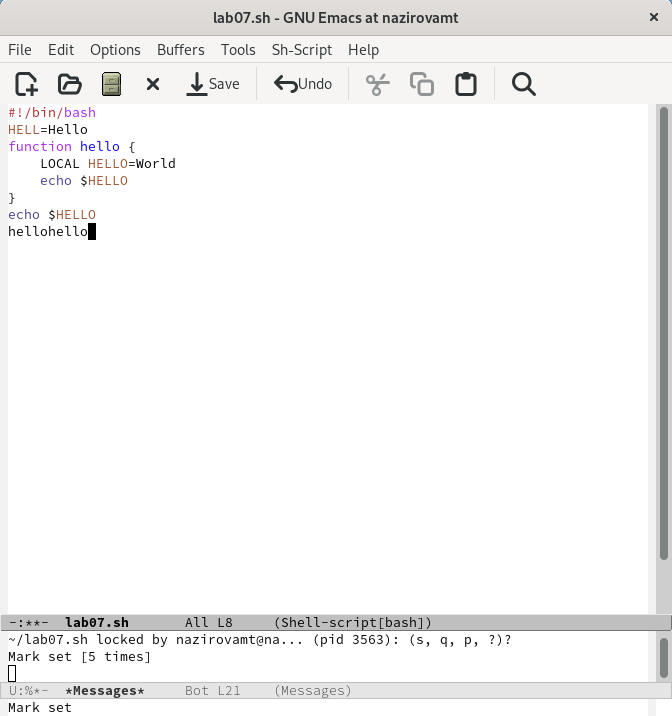{#fig:001 width=70%}

8. Вновь выделить эту область и на этот раз вырезать её (C-w).

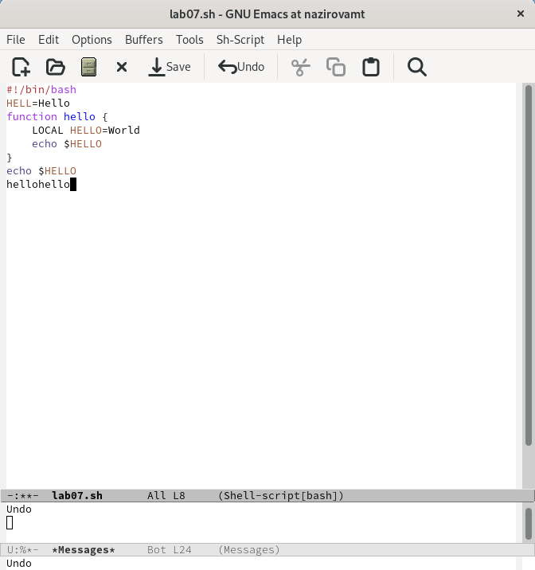{#fig:001 width=70%}

9. Отмените последнее действие (C-/).

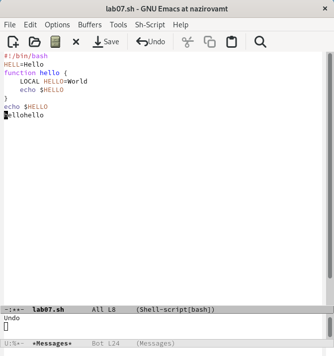{#fig:001 width=70%}

10. Переместите курсор в начало строки (C-a).

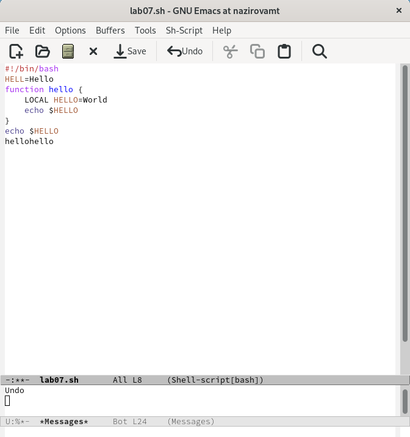{#fig:001 width=70%}

11. Переместите курсор в конец строки (C-e).

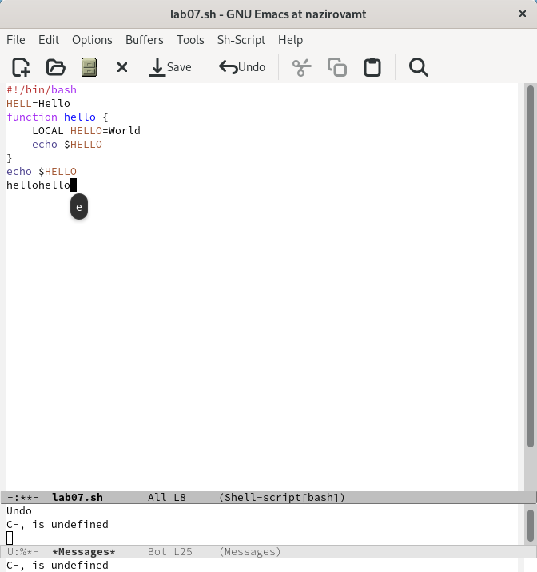{#fig:001 width=70%}

12. Переместите курсор в конец буфера (M->).

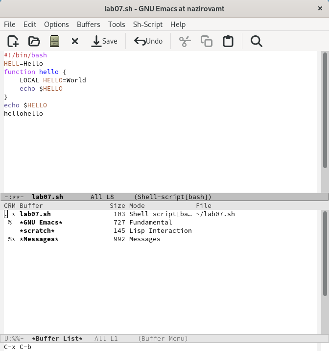{#fig:001 width=70%}

13. Вывести список активных буферов на экран (C-x C-b).

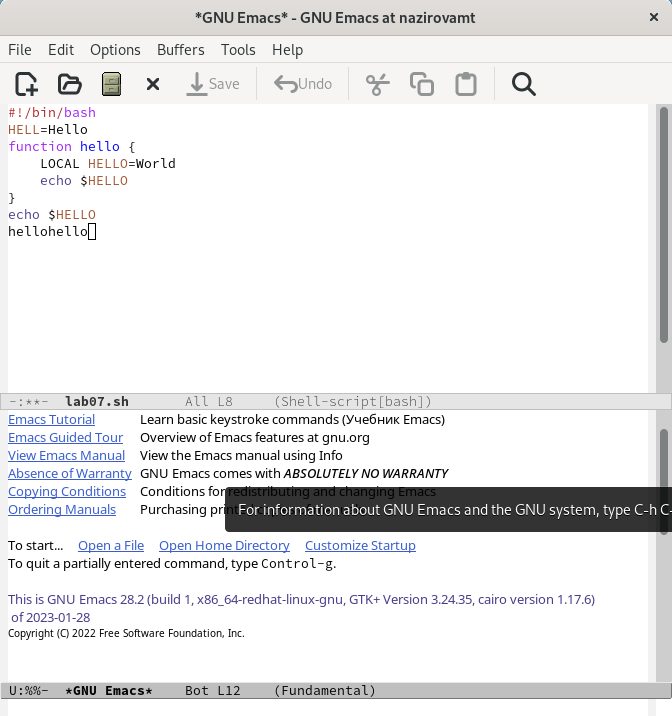{#fig:001 width=70%}

14. Переместитесь во вновь открытое окно (C-x) o со списком открытых буферов
и переключитесь на другой буфер.

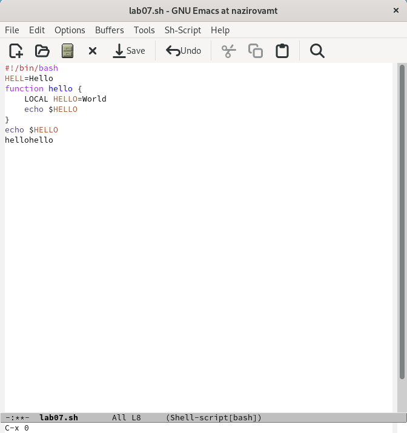{#fig:001 width=70%}

15. Закройте это окно (C-x 0).

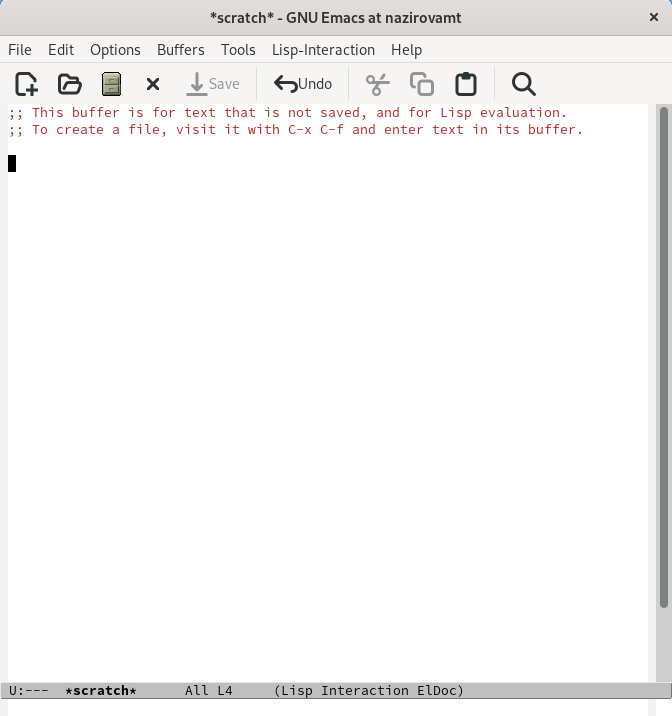{#fig:001 width=70%}

16. Теперь вновь переключайтесь между буферами, но уже без вывода их списка на
экран (C-x b).

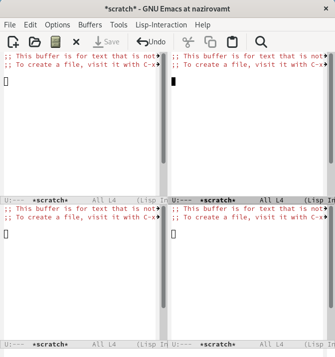{#fig:001 width=70%}

17. Поделите фрейм на 4 части: разделите фрейм на два окна по вертикали (C-x 3),
а затем каждое из этих окон на две части по горизонтали (C-x 2).

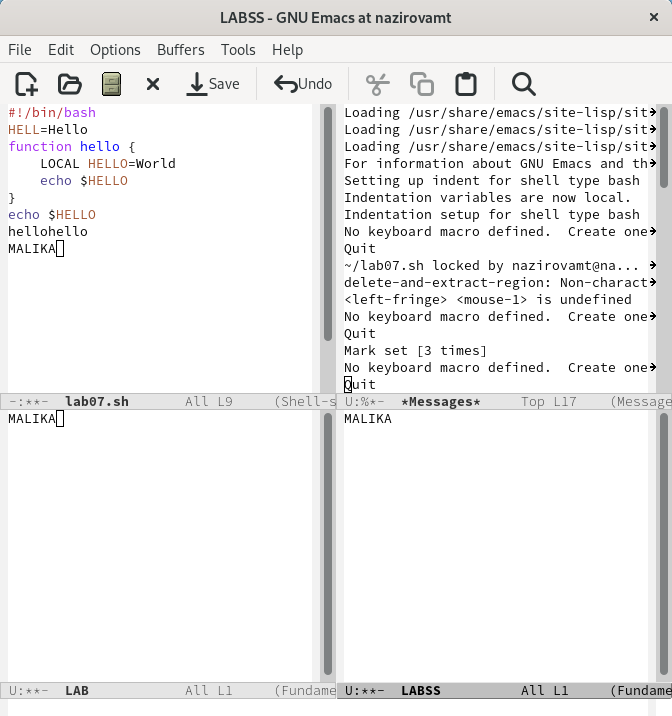{#fig:001 width=70%}

18. В каждом из четырёх созданных окон откройте новый буфер (файл) и введите
несколько строк текста.

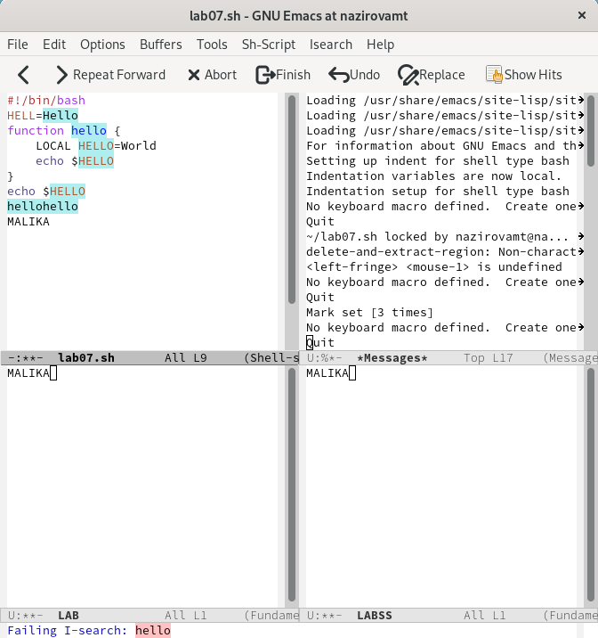{#fig:001 width=70%}

19. Переключитесь в режим поиска (C-s) и найдите несколько слов, присутствующих
в тексте.

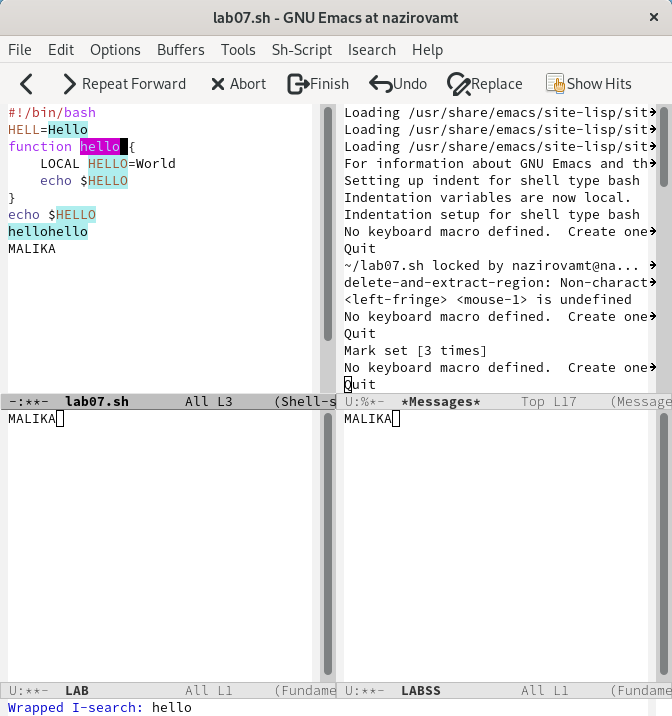{#fig:001 width=70%}

20. Переключайтесь между результатами поиска, нажимая C-s.

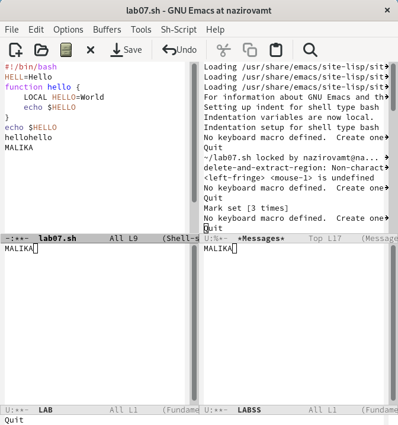{#fig:001 width=70%}

# Выводы

Познакомились с операционной системой Linux. Получили практические навыки работы с редактором Emacs.
