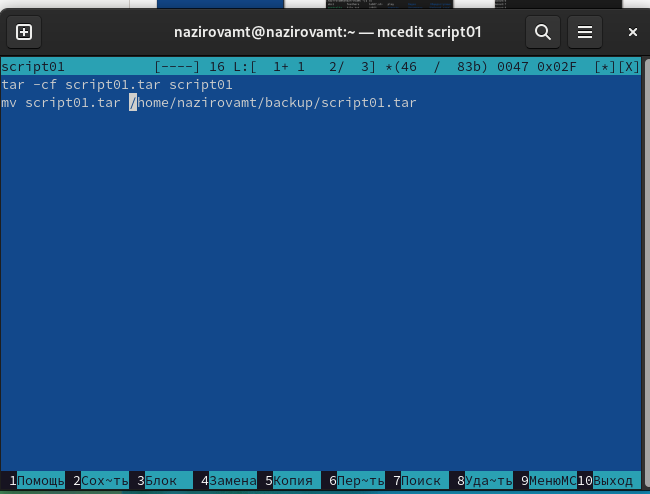
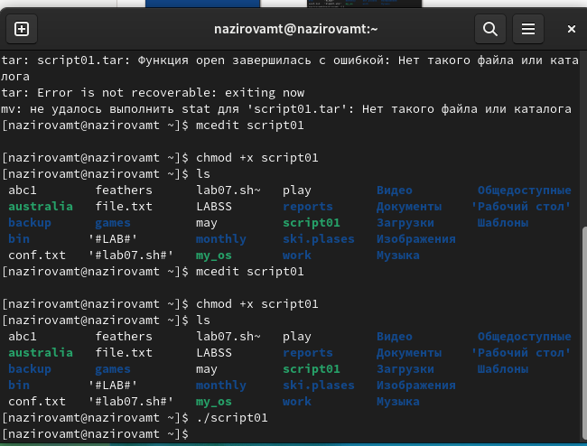
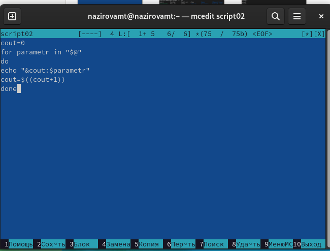
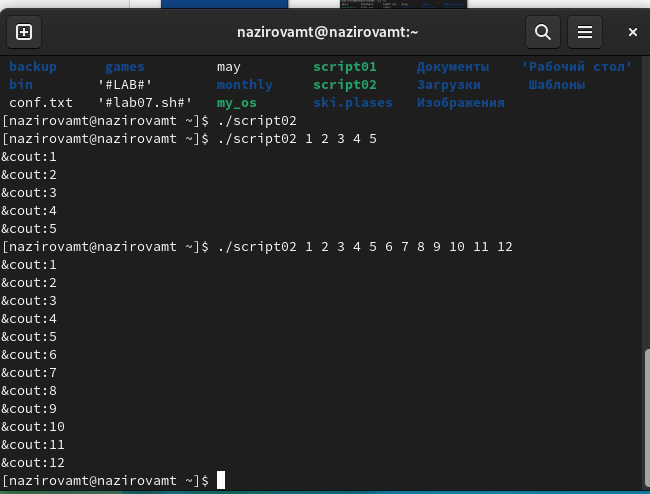
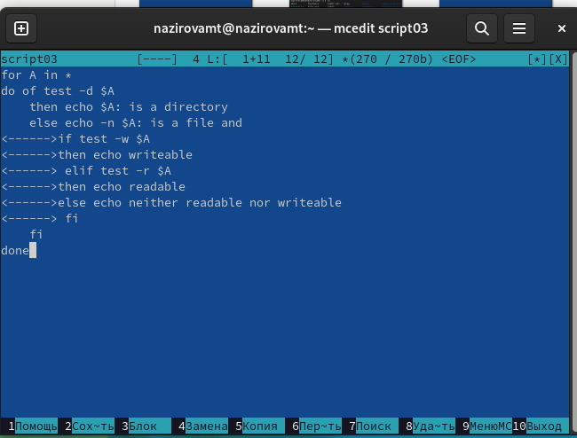
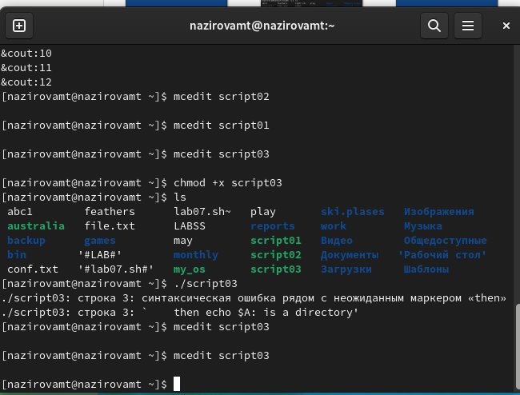
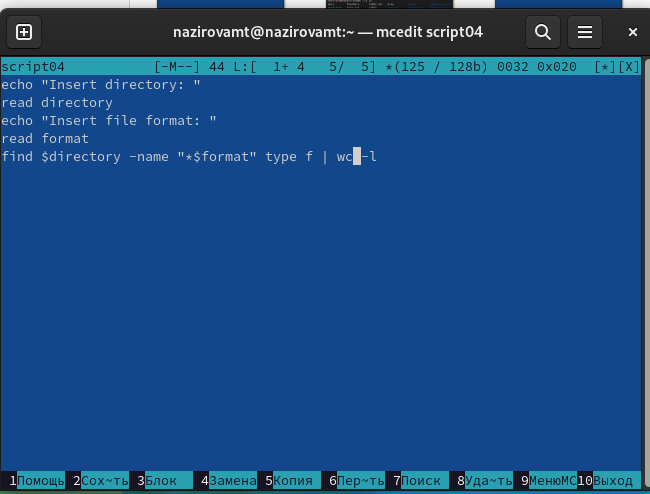
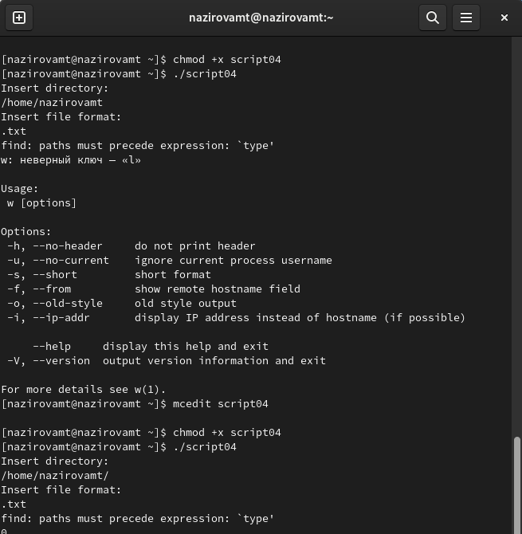

---
## Front matter
lang: ru-RU
title: Лабораторная работа №10
subtitle: 
author:
    - Назирова М.Т.
institute:
  - Российский университет дружбы народов, Москва, Россия
date: 8 апреля 2023

## i18n babel
babel-lang: russian
babel-otherlangs: english

## Formatting pdf
toc: false
toc-title: Содержание
slide_level: 2
aspectratio: 169
section-titles: true
theme: metropolis
header-includes:
 - \metroset{progressbar=frametitle,sectionpage=progressbar,numbering=fraction}
 - '\makeatletter'
 - '\beamer@ignorenonframefalse'
 - '\makeatother'
---

# Информация

## Докладчик

:::::::::::::: {.columns align=center}
::: {.column width="70%"}

  * Назирова Малика Темржоновна
  * студентка группы НКабд-04-22
  * Факультет физико-математических и естественных наук
  * Российский университет дружбы народов
  * [1032225197@pfur.ru](mailto:1032225197@pfur.ru)
  * <https://github.com/sweetliiikk/study_2022-2023_os-intro.git>

:::
::: {.column width="30%"}

:::
::::::::::::::

# Цель работы

    Изучить основы программирования в оболочке ОС UNIX/Linux. Научиться писать
небольшие командные файлы

# Задание

1. Написать скрипт, который при запуске будет делать резервную копию самого себя (то
есть файла, в котором содержится его исходный код) в другую директорию backup
в вашем домашнем каталоге. При этом файл должен архивироваться одним из ар-
хиваторов на выбор zip, bzip2 или tar. Способ использования команд архивации
необходимо узнать, изучив справку.
2. Написать пример командного файла, обрабатывающего любое произвольное число
аргументов командной строки, в том числе превышающее десять. Например, скрипт
может последовательно распечатывать значения всех переданных аргументов.

## Задание

3. Написать командный файл — аналог команды ls (без использования самой этой ко-
манды и команды dir). Требуется, чтобы он выдавал информацию о нужном каталоге
и выводил информацию о возможностях доступа к файлам этого каталога.
4. Написать командный файл, который получает в качестве аргумента командной строки
формат файла (.txt, .doc, .jpg, .pdf и т.д.) и вычисляет количество таких файлов
в указанной директории. Путь к директории также передаётся в виде аргумента ко-
мандной строки.

# Теоретическое введение

    Командный процессор (командная оболочка, интерпретатор команд shell) — это про-
грамма, позволяющая пользователю взаимодействовать с операционной системой
компьютера. В операционных системах типа UNIX/Linux наиболее часто используются
следующие реализации командных оболочек:
– оболочка Борна (Bourne shell или sh) — стандартная командная оболочка UNIX/Linux,
содержащая базовый, но при этом полный набор функций;
– С-оболочка (или csh) — надстройка на оболочкой Борна, использующая С-подобный
синтаксис команд с возможностью сохранения истории выполнения команд;
– оболочка Корна (или ksh) — напоминает оболочку С, но операторы управления програм-
мой совместимы с операторами оболочки Борна;

## Теоретическое введение
– BASH — сокращение от Bourne Again Shell (опять оболочка Борна), в основе своей сов-
мещает свойства оболочек С и Корна (разработка компании Free Software Foundation).
POSIX (Portable Operating System Interface for Computer Environments) — набор стандартов
описания интерфейсов взаимодействия операционной системы и прикладных программ.
Стандарты POSIX разработаны комитетом IEEE (Institute of Electrical and Electronics
Engineers) для обеспечения совместимости различных UNIX/Linux-подобных опера-
ционных систем и переносимости прикладных программ на уровне исходного кода.
POSIX-совместимые оболочки разработаны на базе оболочки Корна.
Рассмотрим основные элементы программирования в оболочке bash. В других оболоч-
ках большинство команд будет совпадать с описанными ниже

# Выполнение лабораторной работы

1. Написать скрипт (рис. @fig:001), который при запуске будет делать резервную копию самого себя (то
есть файла, в котором содержится его исходный код) в другую директорию backup
в вашем домашнем каталоге. При этом файл должен архивироваться одним из ар-
хиваторов на выбор zip, bzip2 или tar. Способ использования команд архивации
необходимо узнать, изучив справку (рис. @fig:002).

{#fig:001 width=70%}

## Выполнение лабораторной работы

{#fig:002 width=40%}

## Выполнение лабораторной работы

2. Написать пример командного файла (рис. @fig:003), обрабатывающего любое произвольное число
аргументов командной строки, в том числе превышающее десять. Например, скрипт
может последовательно распечатывать значения всех переданных аргументов(рис. @fig:004).

{#fig:003 width=50%}

## Выполнение лабораторной работы

{#fig:004 width=40%}

## Выполнение лабораторной работы

3. Написать командный файл — аналог команды ls (рис. @fig:005)(без использования самой этой ко-
манды и команды dir). Требуется, чтобы он выдавал информацию о нужном каталоге
и выводил информацию о возможностях доступа к файлам этого каталога (рис. @fig:006).

{#fig:005 width=50%}

## Выполнение лабораторной работы

{#fig:006 width=40%}

## Выполнение лабораторной работы

4. Написать командный файл (рис. @fig:007), который получает в качестве аргумента командной строки
формат файла (.txt, .doc, .jpg, .pdf и т.д.) и вычисляет количество таких файлов
в указанной директории. Путь к директории также передаётся в виде аргумента ко-
мандной строки (рис. @fig:008).

{#fig:007 width=50%}

## Выполнение лабораторной работы

{#fig:008 width=40%}

# Выводы

Изучили основы программирования в оболочке ОС UNIX/Linux. Научились писать
небольшие командные файлы.
:::

